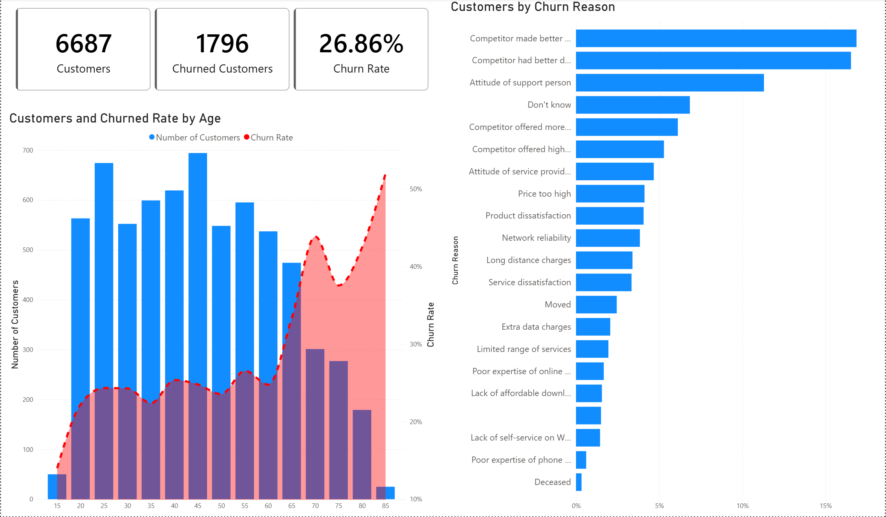

# Customer Churn Analysis — Power BI Case Study

This project analyzes the reasons behind customer churn for a telecom company called Databel. The goal is to understand who is churning, why they are leaving, and what patterns exist across different customer segments. The entire analysis was built using Power BI.

---

## Dataset

The dataset was loaded from a local CSV file. Data preparation was done in Power Query, which included:

- Checking for missing values
- Verifying correct data types
- Reviewing data quality using column quality, column distribution, and column profile tools

---

## DAX Measures

A dedicated measures table was created with the following calculated fields:

```dax
Number of Customers = COUNT('Databel - Data'[Customer ID])
```

```dax
Number of Churned Customers = SUM('Databel - Data'[Churned])
```

```dax
Churn Rate = [Number of Churned Customers] / [Number of Customers]
```

```dax
Avg Customer Service Calls = AVERAGE('Databel - Data'[Customer Service Calls])
```

---

## Report Pages

### Page 1 — Churn Demographics

**Key metrics:** 6,687 total customers, 1,796 churned, 26.86% churn rate.

The age vs. churn chart shows that customers between 20 and 60 make up the largest portion of the base. However, churn rate rises steadily as customer age increases, with older customers being significantly more likely to leave.

The churn reason chart highlights that roughly 44% of churned customers left because of a competitor.



---

### Page 2 — Groups and Categories

Customers who are not part of a group plan pay around $33.50 per month on average and have a churn rate close to 34%. Customers in group plans pay roughly $24 per month and their churn rate stays below 9%.

Monthly contract customers churn at a rate between 40% and 45% regardless of gender. Customers on yearly contracts churn at a maximum rate of around 9%.

The top three churn categories are:
- Competitor: 44.82%
- Attitude: 15.98%
- Dissatisfaction: 15.92%

Contract type breakdown:
- Month-to-Month: 51.01%
- Two Year: 26.87%
- One Year: 22.12%


---

### Page 3 — Unlimited Plan

Customers with an unlimited data plan churn at 32.11%, compared to 16.10% for those without one. Interestingly, customers with an unlimited plan who consume less than 5 GB churn at 34.71%, while those without the plan in the same consumption bracket churn at only 12.31%. This suggests that many customers may be paying for a plan they do not actually need.


---

### Page 4 — Contract Type

There is a clear inverse relationship between account length and churn rate. The longer a customer has been with the company, the less likely they are to churn. This trend holds across all contract types, though month-to-month customers consistently show the highest churn rate (trending around 45–50% in early months), while two-year contract customers stay well below 5%.

Payment method breakdown by customer count:
- Direct Debit: 55.36%
- Credit Card: 39.09%
- Paper Check: 5.55%


---

## Report — Summary Dashboards

### Overview


The overview page consolidates the key metrics and shows that California stands out on the map as having the highest churn rate despite having a relatively small customer base compared to other states.

---

### Age Groups


This page reinforces the demographic findings: older customers churn at higher rates, and monthly billing is strongly associated with churn across all gender segments.

---

### Extra Charges


Average extra international charges sit at $33.64, while average extra data charges are $3.37. The chart confirms that customers with unlimited plans who use less than 5 GB are the most likely to churn, pointing to a mismatch between plan type and actual usage.

---

### Insights


Total customer service calls: 6,123. Average per customer: 0.92.

The state-level line chart reveals an interesting pattern: customers who churned tend to have an average of 1.5 to 3 service calls, while customers who did not churn average 0.5 or fewer calls. This suggests that frequent contact with customer support may be a signal of dissatisfaction rather than engagement.

The map confirms California as the highest-churn state, making it a priority market for retention efforts.

---

## How to Use the Power BI File

> **Important notice for anyone downloading the .pbix file:**
> The dataset is connected to a local CSV file path. After downloading, you will need to update the data source path to point to the CSV file on your own machine.
>
> To do this, open the file in Power BI Desktop, go to **Home > Transform Data > Data Source Settings**, and update the file path to match the location where you have saved the CSV dataset.
> Failing to do this will result in a data refresh error when you open the report.

---

## Tools Used

- Power BI Desktop
- Power Query
- DAX

---

## About

This project was completed as part of an online data analytics course. It covers end-to-end analysis from data loading and transformation through to interactive reporting and insight generation.
